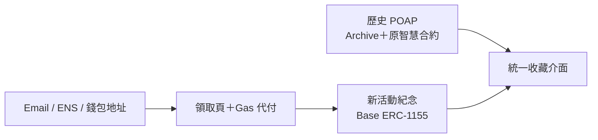

# POAP 留存計畫

[](https://poap.blocktrend.today)
[](https://base.org/)
[](LICENSE)
[](https://github.com/glorylab/poapin-archive)

一套可自行維運的數位活動紀念平臺：保留過去的 POAP 收藏，也讓社群能在 Base
上繼續發行新的活動紀念。歷史資料與新憑證來自不同系統，但會呈現在同一個收藏介面中。

**[開啟公開網站](https://poap.blocktrend.today)** ·
**[閱讀技術架構](docs/PLATFORM-ARCHITECTURE.zh-TW.md)** ·
**[參與貢獻](CONTRIBUTING.md)**

> [!IMPORTANT]
> 這是獨立的社群延續專案，不是 POAP 官方服務。過去的 POAP 仍由原本的 POAP
> 智慧合約定義；本專案新發行的是另一套 ERC-1155 活動紀念，因此不會自動出現在只支援
> POAP 官方合約的第三方 App 中。

## 為什麼需要這個專案？

當原 POAP 平臺不再提供 Drop 建立、發放、管理與收藏頁面時，已經寫入鏈上的 Token
不會消失，但使用者熟悉的產品層會中斷。官方留下的 Archive 快照保存了活動資料、Artwork
與歷史持有人；接下來仍需要有人補上瀏覽、發行、領取與索引。

這個專案把問題拆成兩條互不污染的資料來源，再由同一個前端整合：



- 歷史資料保持唯讀，不修改過去的 POAP 紀錄。
- 新活動使用自行管理的合約、媒體、領取資格與索引。
- 使用者只需要面對一個搜尋、領取與收藏介面。

## 現在可以做什麼？

- 用 Email、ENS、POAP Nickname 或 Ethereum 地址查詢收藏。
- 整合歷史 POAP Archive，以及 Ethereum、Gnosis、Base、Arbitrum 的既有 POAP
  持有人資料。
- 透過不公開的活動 URL 或 QR Code 發放限量紀念。
- Email 使用者以 Magic OTP 登入並自動取得 Embedded Wallet。
- ENS 與 `0x` 地址可直接作為收件地址。
- 由發行方的 relayer 支付 Base Gas，收藏者不需要準備 ETH。
- 在收藏頁統一呈現歷史 POAP 與新發行的 Artwork。
- 已登入的 Magic 使用者可以透過 Magic 的安全介面匯出自己的私鑰；本平臺不會讀取或保存私鑰。
- 自行架設 Cloudflare Worker、D1、R2 與前端，不必依賴本專案的正式環境。

## 收藏者的使用流程

1. 取得主辦單位現場提供的 QR Code 或領取連結。
2. 輸入 Email、ENS、POAP Nickname 或 Ethereum 地址。
3. Email 使用者完成 Magic OTP；其他地址會直接成為收件地址。
4. 平臺代付 Gas，將活動紀念鑄造到 Base。
5. 從同一個收藏頁查看過去的 POAP 與新的活動紀念。

領取頁不需要公開列在首頁。主辦單位可以只把連結提供給實際參與者，並設定供應量、開放時間與
領取碼。

## 系統架構

| 層級       | 技術                                                         | 用途                                      |
| ---------- | ------------------------------------------------------------ | ----------------------------------------- |
| 公開前端   | Astro、React islands、Tailwind CSS、Vercel                   | 搜尋、領取與收藏展示                      |
| API        | Hono、Cloudflare Workers                                     | 驗證、領取、Magic Session、ENS 與索引 API |
| 資料       | Cloudflare D1                                                | 歷史索引、活動、領取與鏈上同步狀態        |
| 媒體       | Cloudflare R2                                                | 歷史 Artwork 與新活動 metadata            |
| 身分與錢包 | Magic Embedded Wallet                                        | Email OTP、錢包建立與私鑰匯出介面         |
| 發行       | Base、ERC-1155、EIP-712                                      | 限量活動紀念、防重播授權與 Gas 代付       |
| 歷史底座   | [POAPin Archive](https://github.com/glorylab/poapin-archive) | 歷史資料匯入、查詢與保存工具              |

詳細資料流與信任邊界請見[平臺技術架構](docs/PLATFORM-ARCHITECTURE.zh-TW.md)。

## 主網狀態

公開站目前使用 Base mainnet。已發行的歷史與新憑證不會因為未來更換合約而消失；前端會聚合
所有已登記的合約。

| 合約               | Base 地址                                                                                                               | 用途                     |
| ------------------ | ----------------------------------------------------------------------------------------------------------------------- | ------------------------ |
| 第一版不可升級合約 | [`0x09567074611047B24f31bcfc33092fC99B3893e5`](https://basescan.org/address/0x09567074611047B24f31bcfc33092fC99B3893e5) | 第一場 Base 正式活動     |
| `STEVE` UUPS Proxy | [`0x9375B610859B1a5fEeA3C7c7C45FC20712F506cB`](https://basescan.org/address/0x9375B610859B1a5fEeA3C7c7C45FC20712F506cB) | 後續可升級的活動紀念合約 |

Proxy 的 implementation、部署交易與 metadata 記錄在
[`contracts/deployments/base-mainnet.json`](contracts/deployments/base-mainnet.json)。合約設計與升級限制請見
[`contracts/README.md`](contracts/README.md)。

## 本機開發

需要 Node.js 22.13 以上與 npm。根目錄提供 Worker、資料庫與工具；公開前端位於
`frontend-astro/`。

```bash
git clone https://github.com/ASTROHSU/poap-continuation-platform.git
cd poap-continuation-platform
npm ci
cp .dev.vars.example .dev.vars
npm run db:setup:local
npm run dev
```

另開一個終端啟動 Astro 前端：

```bash
cd frontend-astro
npm ci
npm run dev
```

常用檢查：

```bash
npm run typecheck
npm test
npm run build

cd frontend-astro
npm run check
npm run build
```

本機 fixtures 刻意維持小型且為合成資料。完整 Archive ZIP、正式 D1、R2 內容、錢包私鑰與
活動領取碼都不會放入 Git。

## 自行部署

自行架設需要準備：

- Cloudflare Workers、D1 與 R2；
- Vercel 或其他可部署 Astro 的環境；
- Magic 應用程式與允許的正式網域；
- Ethereum 與 Base RPC；
- 獨立的合約 owner、claim signer 與 relayer；
- Base Gas 與自己的網域。

請從 `wrangler.pilot.example.jsonc` 與 `.dev.vars.example` 建立自己的設定。不要提交
`wrangler.pilot.jsonc`、`.dev.vars`、Magic Secret、RPC Key、活動 access code、私鑰或部署時產生的
秘密檔案。完整步驟請見[部署文件](docs/deployment.md)與[安全政策](SECURITY.md)。

## 專案結構

| 路徑                      | 用途                                               |
| ------------------------- | -------------------------------------------------- |
| `frontend-astro/`         | 目前公開使用的 Astro 前端                          |
| `src/worker/`             | Cloudflare Worker API、領取、Magic、ENS 與鏈上索引 |
| `contracts/`              | ERC-1155 合約、測試與 UUPS 部署工具                |
| `metadata/`               | 可公開重現的合約與活動 metadata                    |
| `tools/live-event/`       | 建立活動、QR、匯入、稽核與備份工具                 |
| `tools/archive-import/`   | 歷史 Archive 的 D1／R2 匯入工具                    |
| `tools/compass-holdings/` | 補充 Holdings 與 Artwork 的保存工具                |
| `migrations/`             | D1 schema 與 migrations                            |

## 主要文件

- [平臺技術架構](docs/PLATFORM-ARCHITECTURE.zh-TW.md)
- [本機開發與操作](docs/LOCAL-DEVELOPMENT.zh-TW.md)
- [Base Sepolia 部署手冊](docs/BASE-SEPOLIA-DEPLOYMENT.zh-TW.md)
- [Base 鏈上索引手冊](docs/CHAIN-INDEXER.zh-TW.md)
- [Pilot 操作與復原手冊](docs/PILOT-RUNBOOK.zh-TW.md)
- [Magic Email 樣式設定](docs/MAGIC-EMAIL-CUSTOMIZATION.zh-TW.md)
- [歷史資料匯入](docs/data-import.md)
- [資料來源與授權](docs/data-and-licensing.md)
- [貢獻指南](CONTRIBUTING.md)
- [安全政策](SECURITY.md)

## 歡迎協作

這個 repository 的目標不是只服務單一活動，而是留下可重用的社群基礎設施。特別歡迎以下方向：

- Archive 與跨鏈持有人資料的正確性；
- relayer 併發、nonce 管理、重試與可觀測性；
- 手機版、無障礙與多語介面；
- 自行部署流程與成本控制；
- 合約、API 與資料匯入的安全檢查；
- 讓其他社群也能建立自己的發行與收藏體驗。

開始前請閱讀[貢獻指南](CONTRIBUTING.md)、[行為準則](CODE_OF_CONDUCT.md)與
[安全政策](SECURITY.md)。一般問題與功能建議可以使用
[GitHub Issues](https://github.com/ASTROHSU/poap-continuation-platform/issues)；安全問題請依
`SECURITY.md` 私下回報。

## 資料、授權與商標

程式碼使用 [MIT License](LICENSE)。MIT License 不會自動授權 POAP Archive 資料、活動
Artwork、第三方 Logo、名稱或商標；這些內容仍受各自權利與來源條款約束。鏡像或重新發布資料前，
請先閱讀 [NOTICE.md](NOTICE.md)、[ASSETS-LICENSE.md](ASSETS-LICENSE.md)與
[資料來源及授權說明](docs/data-and-licensing.md)。

本專案不隸屬、不代表，也未獲 POAP 官方背書。

## 致謝

歷史 Archive 瀏覽、資料匯入與 Cloudflare 架構建立在 Kira 與 Glory Lab 開源的
[POAPin Archive](https://github.com/glorylab/poapin-archive) 之上。沒有他們先完成歷史保存與瀏覽器，
這個延續平臺就必須從零開始。

本 fork 保留上游 MIT 授權聲明，差異與額外工作記錄在 [NOTICE.md](NOTICE.md)。
