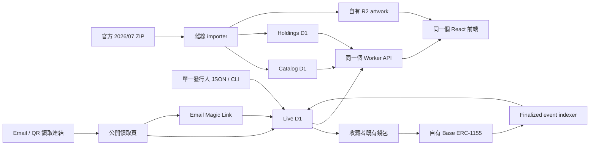

# MVP 技術架構

## 核心原則

歷史資料是不可變來源，新發行資料是可變來源。兩者只在 API 與前端合併，不共用資料表，也不把新資料偽裝成舊 POAP。



## 為何由收藏者錢包送出交易

若網站替收藏者即時鑄造，Worker 必須持有熱錢包私鑰，並處理 nonce 競爭、RPC 重試、Gas 補價與失敗復原。對單一發行人與低頻活動而言，這些維運風險大於即時體驗的收益。因此 Worker 只簽發短效 EIP-712 授權，由收藏者自己的錢包送出交易。

MVP 將領取分成兩步：

1. 立即連接錢包；或先驗證 Email 並保留名額，日後再綁定既有錢包。
2. 收藏者錢包送出交易；Worker 驗證鏈上 receipt 後再把 tx hash 回寫 D1。

未來若即時性變重要，可在不改前端資料模型的情況下加入 Queue／Durable Object relayer。

## 資料邊界

### Catalog D1

固定快照的 Drop metadata、搜尋欄位與圖片 reference。只讀。

### Holdings D1

固定快照的地址、token 與 Drop 關係。只讀，不能宣稱是當前所有權。

### Live D1

`live_events`：協會新活動與未來 Base token 的對應。
`live_claim_codes`：一次性碼 digest、Email 保留識別、領取地址、領取時間、鑄造交易。
`live_email_challenges`：Magic Link token digest、Email HMAC 與加密內容。
`live_email_sessions`：Email Session token digest、有效期限與撤銷狀態。
`live_chain_cursors`：每個 Base 合約的部署區塊、下一掃描區塊與 finalized 進度。
`live_chain_events`：去重後的 ERC-1155 mint、transfer 與 burn 事件日誌。
`live_token_balances`：由事件日誌投影出的目前持有人與餘額。

原始領取碼只存在於發行人本機產生的 CSV，不進 Git、不寫 D1、不寫伺服器 log。
明文 Email 只在收到請求與呼叫寄信供應商時短暫存在；D1 僅保存 HMAC 與 AES-256-GCM 密文。

### R2

歷史原圖與新發行原圖均存在自有 bucket，但使用不同 prefix：

```text
snapshots/2026-07-02-v1/artwork/{drop_id}.webp
live/{event_id}/original.{ext}
live/{event_id}/metadata.json
```

## 安全

- 一次性碼至少 192-bit 隨機值，D1 只保存 SHA-256。
- 領取使用單一條件式 `UPDATE ... RETURNING`，避免同一碼併發領取兩次。
- Claim POST 不快取，使用既有 rate limiter。
- Cloudflare 只保存獨立 claim signer，不保存合約 owner、部署錢包或收藏者私鑰。
- Magic Link 單次使用且 15 分鐘失效；Email Session 為 HttpOnly、SameSite Cookie。
- `claim-links.csv` 權限設為 owner-only，並由 `.gitignore` 排除 build 輸出。
- 正式上線前需設定 CSP、備份、資料移除聯絡方式與最短必要 log retention。

## 部署資源

- 1 個 Workers 專案：React 靜態資產 + Hono API。
- 3 個 P0 D1：Catalog、Holdings、Live。
- 1 個 R2 bucket：歷史 artwork 與新 metadata。
- Base RPC 只供 receipt 驗證與每分鐘 finalized event indexer；一般瀏覽只讀 D1，
  不在每次頁面請求時呼叫 RPC。

上游 repo 的 Collections 與 Moments 可以保留，但不列為 MVP 上線依賴。若要進一步降低維護面，可在 Phase 1 移除其 route、binding 與 UI。

## 主要故障模式

- Archive DB 無法讀：Live 收藏與領取仍應可用。
- Live DB 無法讀：歷史收藏仍應可用。
- R2 圖片缺失：卡片顯示 metadata 與 fallback，不阻擋領取。
- Base RPC 失敗：claim 與已確認交易紀錄保留，index cursor 不前進，下一次排程重試。
- Event batch 不完整或來源餘額不合理：D1 batch 整批回滾，避免 projection 半套更新。
- Indexer 暫時落後：收藏頁保留已鑄造 claim 的 fallback；追上 finalized chain 後，
  由 `live_token_balances` 接管目前所有權。
