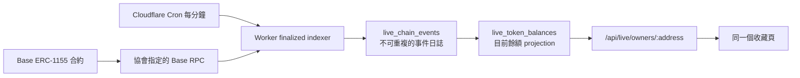

# Phase 3：Base 鏈上索引與目前持有人

本階段補上「鏈上已經發生什麼事」到收藏頁之間的同步層。領取完成後，即使 NFT
之後轉移到另一個錢包，`/address/:address` 也會顯示目前持有人，而不是永遠顯示最初
領取者。

Phase 3 的程式同時支援 Base Sepolia（`84532`）與 Base mainnet（`8453`），但正式主網
部署仍必須等 Phase 2／2.5 的 Cloudflare、寄信與 Sepolia 真實驗收通過。

## 資料流



Indexer 只接收 finalized 區塊，依 `chain_id + contract_address + tx_hash + log_index +
sub_index` 去重。每次最多掃 1,900 個區塊與 400 筆相關 transfer；成功寫入事件與更新
cursor 使用同一個 D1 batch。任何事件不合理或資料庫更新失敗時，cursor 不前進，下次
排程從相同區塊安全重試。

## 已完成能力

- ERC-1155 `TransferSingle` 與 `TransferBatch` 解碼。
- 只投影 `live_events` 已登記的 token ID，忽略同合約內其他 NFT。
- mint、transfer、burn 與重新取得後的目前餘額。
- append-only `live_chain_events`，重播相同 log 不會重複計算。
- `live_token_balances` 目前持有人 projection。
- 每個合約獨立 `start_block`、`next_block` 與 finalized cursor。
- 每分鐘 Cloudflare Cron 排程。
- Base Sepolia 與 Base mainnet RPC 分流與 chain ID 驗證。
- 索引完成前沿用 claim record，追上 finalized chain 後改以 chain index 為準。
- 公開且短暫快取的健康檢查：`GET /api/live/indexer/status`。
- 轉移後，舊錢包不再顯示該 NFT，新錢包可以直接查到。

## 1. 套用資料庫 migration

```bash
npx wrangler d1 migrations apply LIVE_DB --remote
```

`0005_chain_indexer.sql` 會建立：

- `live_chain_cursors`
- `live_chain_events`
- `live_token_balances`
- 維持 balance projection 與阻擋不合理 debit 的 triggers

## 2. 設定正式 RPC

repo 內的 Base 公共 RPC 只適合開發與驗收。正式環境應換成協會自己的 production RPC
provider URL：

```json
{
  "vars": {
    "BASE_RPC_URL": "https://你的-base-sepolia-rpc",
    "BASE_MAINNET_RPC_URL": "https://你的-base-mainnet-rpc"
  }
}
```

RPC 必須支援 `eth_chainId`、`eth_getBlockByNumber` 的 `finalized` tag 與
`eth_getLogs`。Base 官方也標示公開 RPC 有 rate limit，不建議直接用於正式服務：

- [Base RPC endpoints](https://docs.base.org/base-chain/api-reference/rpc-overview)
- [Base `eth_getLogs`](https://docs.base.org/base-chain/api-reference/ethereum-json-rpc-api/eth_getLogs)

## 3. 登記合約部署區塊

部署腳本輸出的 `blockNumber` 就是 `--start-block`。必須使用合約部署區塊，不能使用第一
次領取的區塊，否則在它之前發生的 mint 會永久漏掉。

```bash
npm run event:chain -- \
  --slug first-test \
  --contract 0x合約地址 \
  --token-id 1 \
  --start-block 12345678 \
  --chain-id 84532 \
  --target remote \
  --confirm-remote first-test
```

同一合約的多個活動共用一個 cursor。`event:chain` 應在公開領取網址前完成，讓 indexer
從部署區塊開始掃描。

## 4. 部署與排程

`wrangler.jsonc` 已設定每分鐘排程：

```json
{
  "triggers": {
    "crons": ["* * * * *"]
  }
}
```

部署後，Cloudflare 會呼叫 Worker 的 `scheduled()` handler。Cron 使用 UTC；這裡只依
分鐘執行，不受時區影響。官方操作與限制：

- [Cron Triggers](https://developers.cloudflare.com/workers/configuration/cron-triggers/)
- [Workers limits](https://developers.cloudflare.com/workers/platform/limits/)

## 5. 查看索引狀態

```bash
curl https://你的網域/api/live/indexer/status
```

回應範例：

```json
{
  "items": [
    {
      "chainId": 84532,
      "contractAddress": "0x...",
      "startBlock": 12345678,
      "nextBlock": 12345901,
      "lastFinalizedBlock": 12345900,
      "lagBlocks": 0,
      "lastSyncedAt": "2026-07-31T12:00:00.000Z",
      "indexedEvents": 42,
      "currentHolders": 38
    }
  ]
}
```

正常條件：

- `lastSyncedAt` 持續更新。
- `lagBlocks` 通常回到 `0`。
- 發生 mint／transfer 後，`indexedEvents` 增加。
- `currentHolders` 是正餘額地址數，不是歷史領取人次。

## 6. 驗收流程

先在 Base Sepolia 完成：

1. 用地址 A 鑄造 token。
2. 60 秒內確認地址 A 的收藏頁顯示「鏈上目前持有」。
3. 從 A 轉移到地址 B。
4. 等待 finalized 與下一次排程。
5. 地址 A 不再顯示；地址 B 顯示同一 NFT。
6. 暫停 Worker Cron，執行數次 mint／transfer，再恢復。
7. 確認 cursor 從原位置續跑且結果正確。
8. 重跑同一區塊，確認 `indexedEvents` 與 balance 不重複。

Phase 3 自動測試已覆蓋 mint、transfer、batch、重複事件、錯誤 batch 回滾、cursor
續跑、目前持有人查詢與健康 API。真實 RPC、finality、Cloudflare Cron 與錢包相容性
仍需在協會環境驗收。

## 故障與復原

- **RPC 暫時失敗**：該合約記為一次 failure，cursor 不前進，下一分鐘重試。
- **錯誤 RPC 網路**：chain ID mismatch，拒絕寫入。
- **遺漏早期 mint**：修正 `start_block` 後，清除該合約的事件／balance projection，
  將 cursor 重設為部署區塊，再完整重掃。這是資料維護操作，正式執行前必須備份 D1。
- **Indexer 落後**：已鑄造 claim 暫時顯示「等待索引」；追上 finalized 區塊後才由
  chain projection 接管，不會因短暫落後誤判 NFT 消失。
- **D1 損毀**：`live_chain_events` 與 `live_token_balances` 都可由 Base 合約事件重建；
  `live_events`、claim 與 Email reservation 仍須由 D1 備份還原。

不要以瀏覽器送回的 transaction hash 或 claim record 當成永久所有權來源。當 cursor
追上 finalized chain 後，鏈上事件 projection 才是新 NFT 收藏頁的目前所有權依據。
